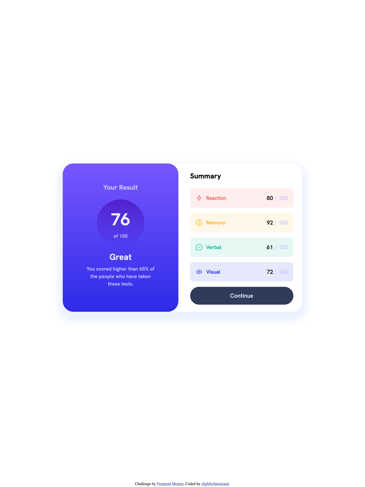

# Frontend Mentor - Results summary component solution

This is a solution to the [Results summary component challenge on Frontend Mentor](https://www.frontendmentor.io/challenges/results-summary-component-CE_K6s0maV). Frontend Mentor challenges help you improve your coding skills by building realistic projects. 

## Table of contents

- [Overview](#overview)
  - [The challenge](#the-challenge)
  - [Screenshot](#screenshot)
  - [Links](#links)
- [My process](#my-process)
  - [Built with](#built-with)
  - [Continued development](#continued-development)
- [Author](#author)

## Overview

### The challenge

Users should be able to:

- View the optimal layout for the interface depending on their device's screen size
- See hover and focus states for all interactive elements on the page

### Screenshot

### Links

- Live Site URL: [Results Summary Component](https://slightlyfunctional.gitlab.io/results-summary-component/)

## My process

### Built with

- Semantic HTML5 markup
- CSS custom properties
- Flexbox
- Mobile-first workflow
- [Sass](https://nextjs.org/) - CSS Preprocessor
- [Parcel](https://parceljs.org/) - Bundler

### Continued development

This small project was a challenge on based on time to completion. I estimated about 5 hours until completion, starting at roughly 6pm initializing the project, nearly completing it by 11:00pm PST. I also aimed to try it using CSS only (no frameworks) to see if i've improved my confidence in writing CSS (or Sass in this case). It is a close however there are small differences with the design spec. 

## Author

- Website - [slightlyfunctional.com](https://slightlyfunctional.com)
- Frontend Mentor - [@slightlyfunctional](https://www.frontendmentor.io/profile/slightlyfunctional)
